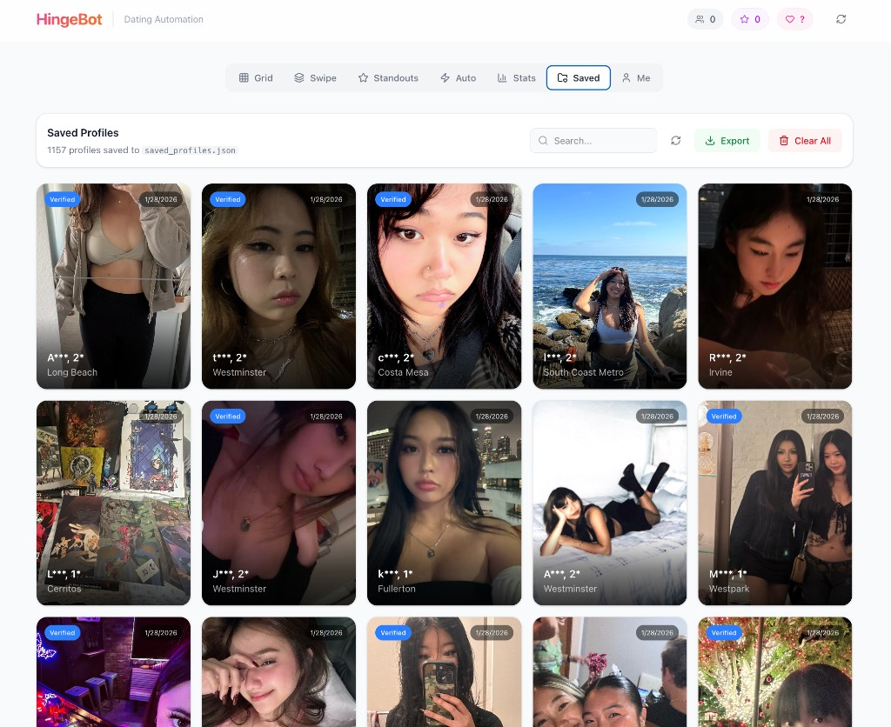

# HingeBot 🔥

A web-based automation tool for Hinge dating app. Browse, filter, and manage profiles with a modern UI.


## Features

- **Grid View** - See many profiles at once, bulk select and like
- **Swipe View** - Tinder-style single profile interaction
- **Standouts** - View Hinge's featured profiles
- **Auto-Liker** - Automatically like profiles matching your filters
- **Analytics** - Stats on profiles you're being shown
- **Saved Profiles** - Auto-save profiles to local JSON file
- **Advanced Filters** - Filter by age, height, location, drinking, smoking, religion, etc.

## Screenshot



## Prerequisites

- Python 3.10+
- Node.js 18+
- iOS device with Hinge app
- [HTTP Toolkit](https://httptoolkit.com/) (for credential extraction)

## Installation

### 1. Clone the repository

```bash
git clone https://github.com/lyeric2022/hingebot.git
cd hingebot
```

### 2. Set up Python backend

```bash
python3 -m venv venv
source venv/bin/activate
pip install -r requirements.txt
```

### 3. Set up Next.js frontend

```bash
cd web
npm install
cd ..
```

### 4. Extract Hinge credentials

You need to capture your Hinge API credentials using HTTP Toolkit:

1. Install [HTTP Toolkit](https://httptoolkit.com/) on your computer
2. Connect your iPhone to the same WiFi network
3. In HTTP Toolkit, click "Intercept" → "Fresh Terminal" or set up iOS interception
4. Configure your iPhone's WiFi proxy to point to HTTP Toolkit (your computer's IP, port 8001)
5. Open Hinge app on your phone and browse profiles
6. In HTTP Toolkit, find a request to `prod-api.hingeaws.net`
7. Extract these values from the request headers:

### 5. Configure environment

Create a `.env` file in the project root:

```env
BEARER_TOKEN=your_bearer_token_here
SESSION_ID=your_session_id_here
USER_ID=your_user_id_here
DEVICE_ID=your_device_id_here
INSTALL_ID=your_install_id_here
```

## Usage

### Start the backend API

```bash
cd hingebot
source venv/bin/activate
python api.py
```

The API runs on `http://localhost:8080`

### Start the frontend

```bash
cd hingebot/web
npm run dev
```

Open `http://localhost:3000` in your browser.

## API Endpoints

| Endpoint | Method | Description |
|----------|--------|-------------|
| `/api/recommendations` | GET | Get profile recommendations |
| `/api/like` | POST | Like a profile |
| `/api/skip` | POST | Skip a profile |
| `/api/standouts` | GET | Get standout profiles |
| `/api/like-limit` | GET | Get remaining daily likes |
| `/api/saved-profiles` | GET | Get locally saved profiles |
| `/api/save-profiles` | POST | Save profiles to local file |
| `/api/me` | GET | Get your own profile info |
| `/api/account` | GET | Get account/subscription info |
| `/api/traits` | GET | Get your preferences |

## Project Structure

```
hingebot/
├── api.py              # FastAPI backend
├── main.py             # CLI tool (optional)
├── .env                # Credentials (not committed)
├── saved_profiles.json # Auto-saved profiles (not committed)
├── HingeSDK/           # Unofficial Hinge SDK
└── web/                # Next.js frontend
    ├── src/
    │   ├── app/        # Pages
    │   └── components/ # React components
    └── package.json
```

## Limitations

- **No "Who Liked You"** - Hinge doesn't expose this via API (premium-only in app)
- **No Profile Views** - Can't see who viewed your profile
- **Rate Limiting** - Too many requests will temporarily block you
- **Token Expiry** - Credentials expire after a few hours, need to refresh

## Disclaimer

⚠️ **Use at your own risk.** This tool uses unofficial APIs and may violate Hinge's Terms of Service. Your account could be suspended or banned. This project is for educational purposes only.

## License

MIT License - see [LICENSE](LICENSE) for details.

## Contributing

Pull requests welcome! Please open an issue first to discuss changes.
